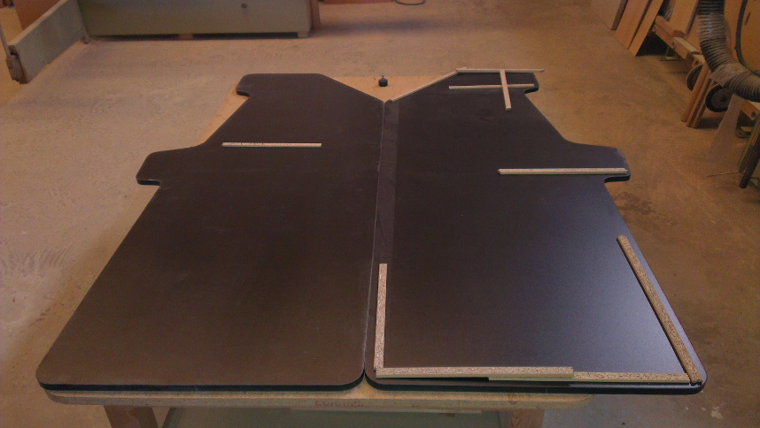
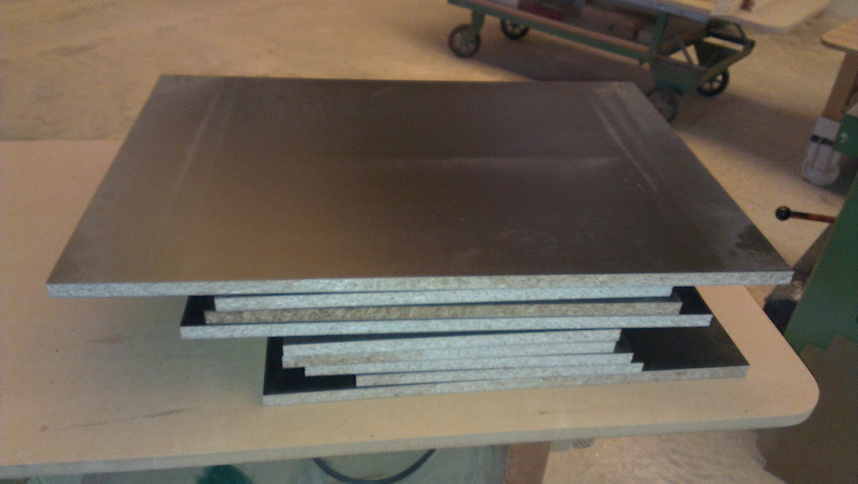
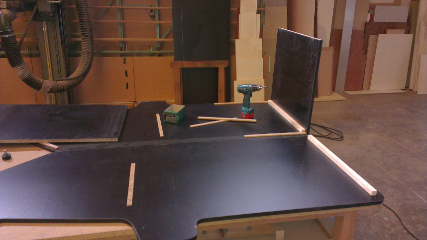
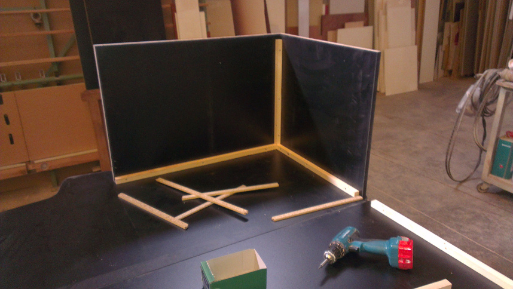
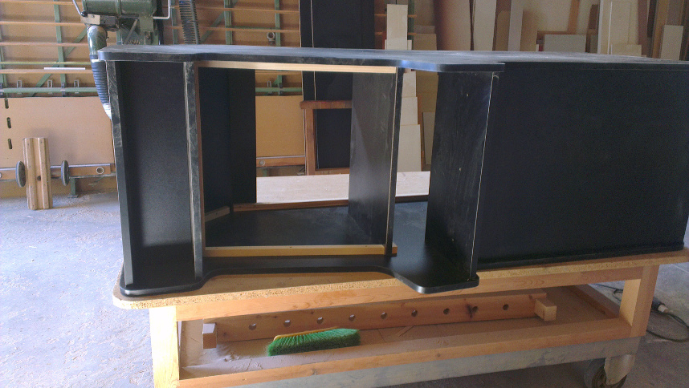
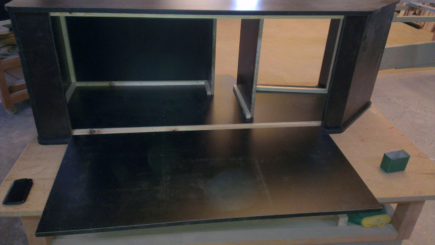
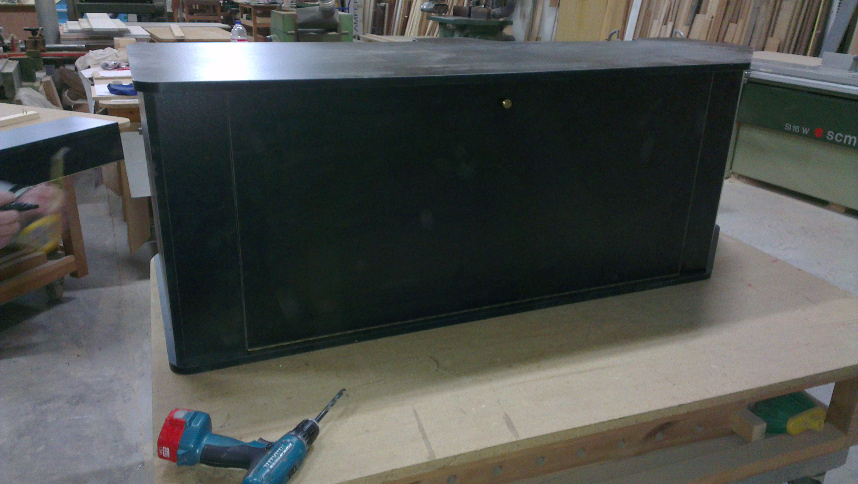

# Mueble
Para la construcción del mueble he utilizado tableros de aglomerado de melamina negra  de 19 mm de grueso.

Los cantos han sido chapados con canto de PVC de color negro.

La unión de las piezas se ha realizado utilizando listones cuadrados de 2 cm. x 2 cm., consiguiendo que de esta forma no se vean los tornillos desde fuera.

El montaje se ha realizado encima de una mesa y la máquina colocada en posición horizontal, para su mejor montaje.

>Laterales

>Resto de piezas

>Inicio del montaje

>Montaje

>Montaje, parte trasera

>Montaje, frontal

Para la puerta se ha utilizado una bisagra de piano.

>Puerta montada

>Detalle de la bisagra de la puerta

>Puerta cerrada

Para el panel de control también se ha utilizado una bisagra de piano.

>Panel de control
