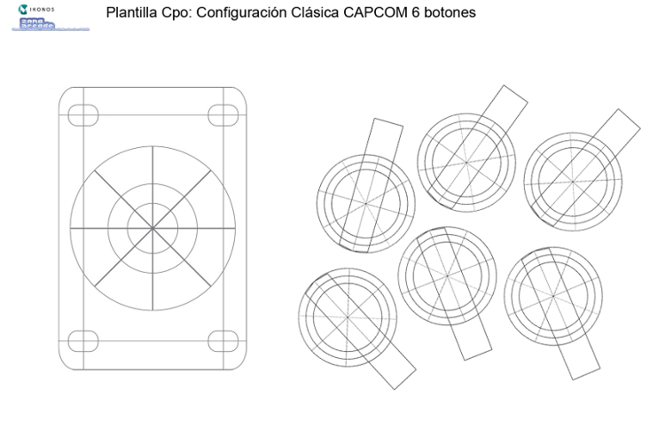
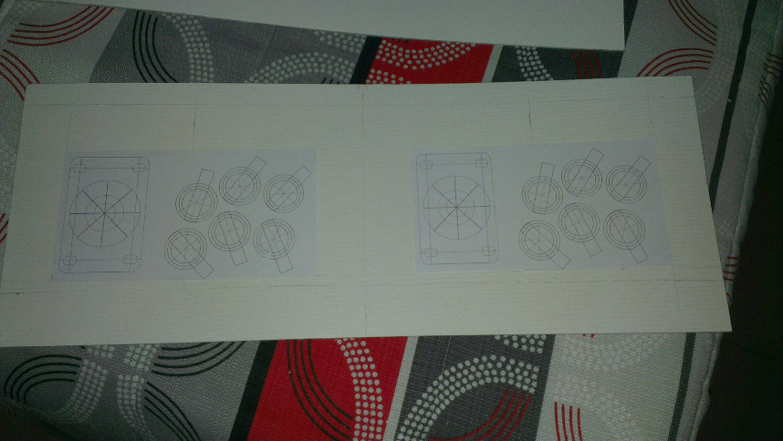
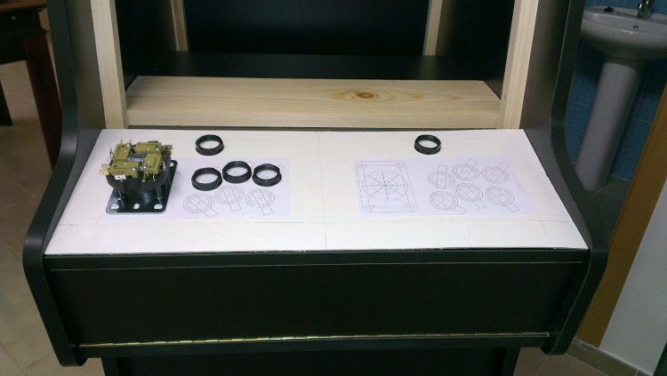
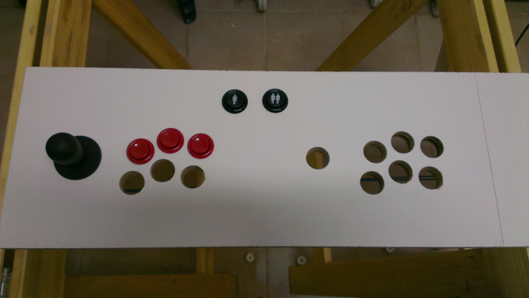
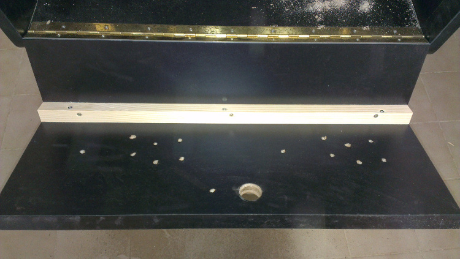

# Panel de Control

Para el panel de control me basé en el siguiente modelo:

>Modelo botones

Este modelo lo obtuve del  foro de ZonaArcade, del siguiente link:
[ZonaArcade - Plantillas de botones y palancas con las configuraciones más populares para tu panel de control arcade.](http://zonaarcade.forumcommunity.net/?t=13788157)

Antes de agujerear el panel de control utilicé una plantilla de cartón para realizar las pruebas de distribución de botones y palancas.

> Plantilla cartón planel de control

> Plantilla cartón sobre panel de control

Después de esto hice los agujeros del panel de control sobre un trodo de aglomerado de igual tamaño que este, para ver como quedaba y comprobar que estaba todo correcto.

> Prueba panel de control

Para el panel de control también se ha utilizado una bisagra de piano.

>Panel de control

