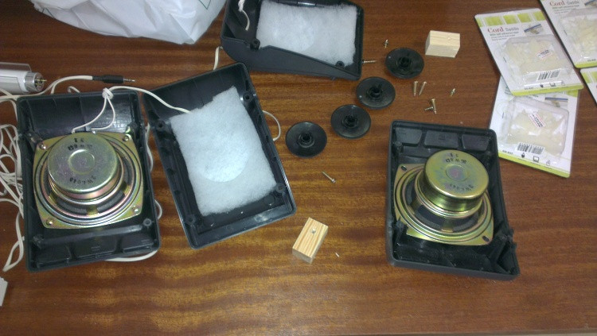
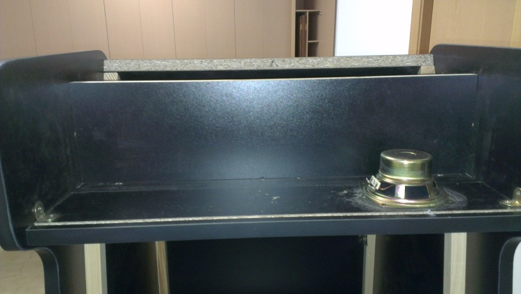
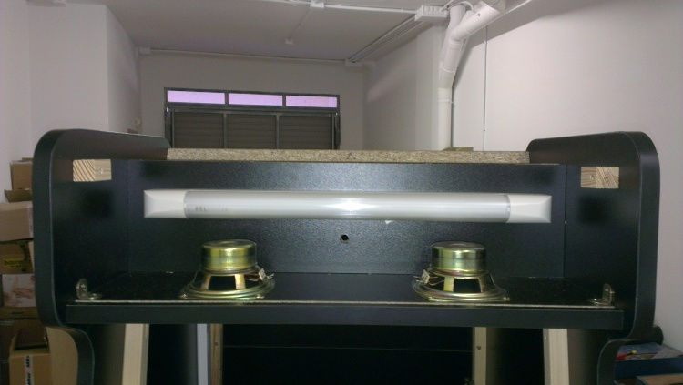

# El Sonido

Para el sonido de la máquina he utilizado unos altavoces viejos que tenía por casa y que hace tiempo usaba para el ordenador.

> Altavoces desmontados

Una vez desmontados los he posicionado sobre la marquesina a ver como los repartía.

> Altavoz situado sobre marquesina

Cuando he encontrado la posición en la que quería situarlos he hecho los agujeros pertinentes.

> Agujeros altavoces realizados

Después de realizar los agujeros he montado los altavoces y el tubo de luz.

> Altavoces y el tubo de luz de la marquesina

Una vez montado todo lo anterior he montado los embellecedores de los altavoces.

> Embellecedores de los altavoces montados
