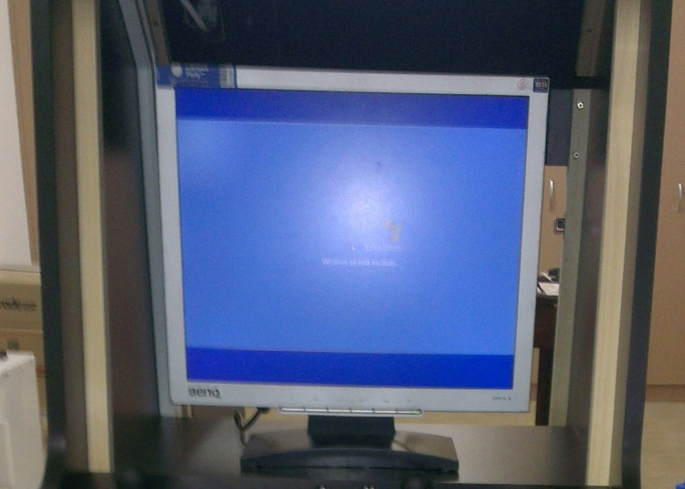
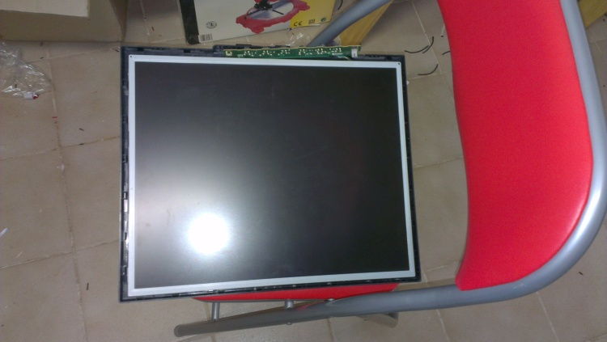
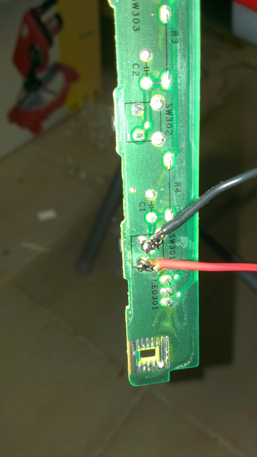
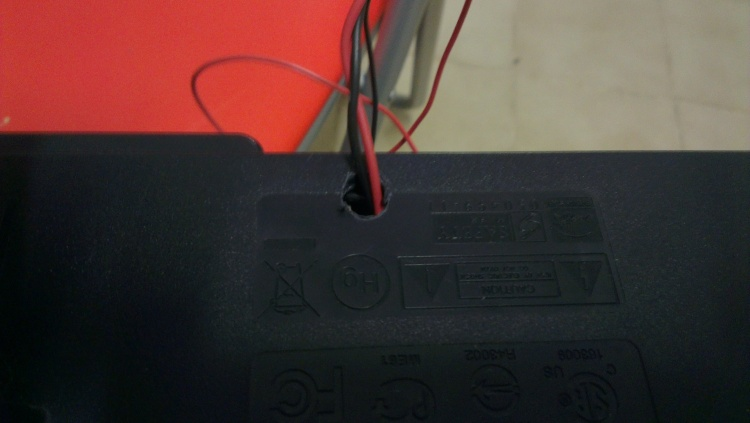
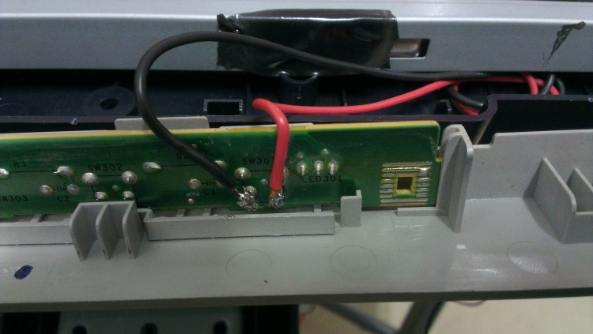
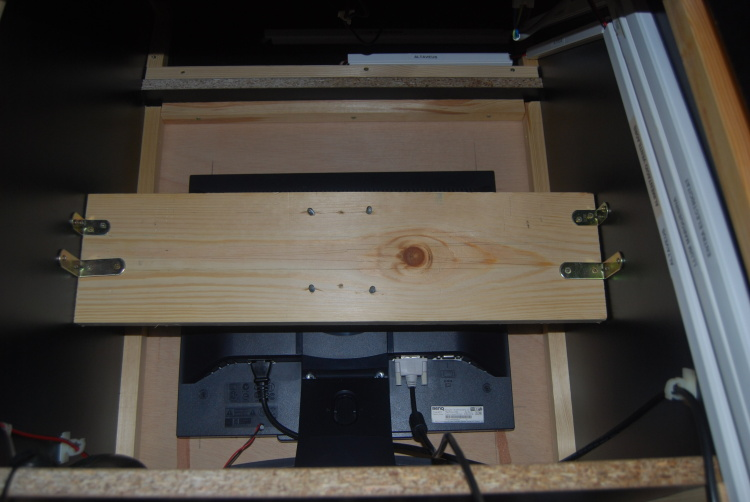
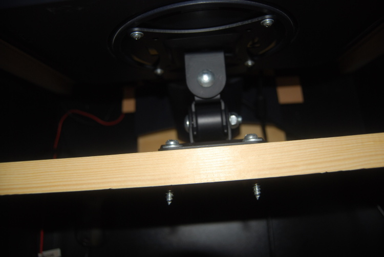

# El Vídeo

Para el vídeo de la máquina he utilizado un monitor viejo de 19 pulgadas de 4:3.

> Monitor

Este monitor tiene el problema de que cuando se le alimenta no recuerda el estado anterior y siempre está apagado, para que  se encienda se le ha de pulsar siempre el botón.
Para solucionar el problema he tenido que desmontarlo y meterle 2 cables para poder enchufarlo desde el exterior de la máquina.

Los pasos que he seguido para meter los cables han sido:

Lo primero que he hecho ha sido quitarle el marco al monitor y buscar en el panel de botones el botón de encendido

> Monitor sin su marco

Después de encontrar el botón de encendido le he soldado 2 cables para poder conectar a un botón del frontal de la máquina.

> Detalle de la botonera con los 2 cables soldados

Después de soldar los cables he hecho un agujero en la parte posterior del monitor para sacar los cables

> Detalle del agujero hecho para sacar los cables

Una vez sacados los cables por el agujero he situado la botonera en su sitio y he cerrado el monitor.

> Detalle de la botonera en su sitio con los cables ya soldados

Para que el monitor no se mueva he construido un soporte para este. El monitor y el soporte van unidos por un soporte de monitor vesa.

El soporte está formado por una pieza de madera que tiene la anchura de la máquina y de altura es un poco mayor que la del soporte del monitor vesa. Este ha sido fijado a la máquina con 24 escuadras, 2 a cada lado.

> Soporte monitor

> Conexión del monitor al soporte
