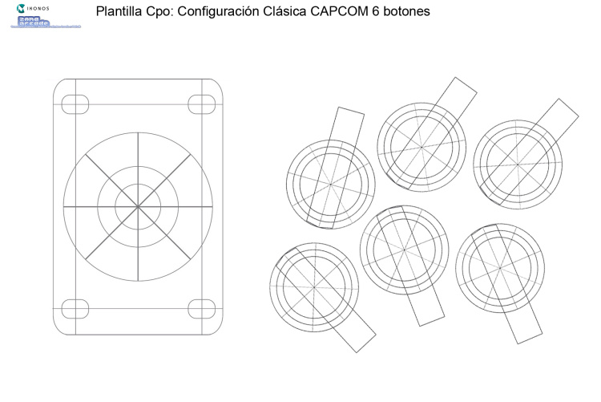
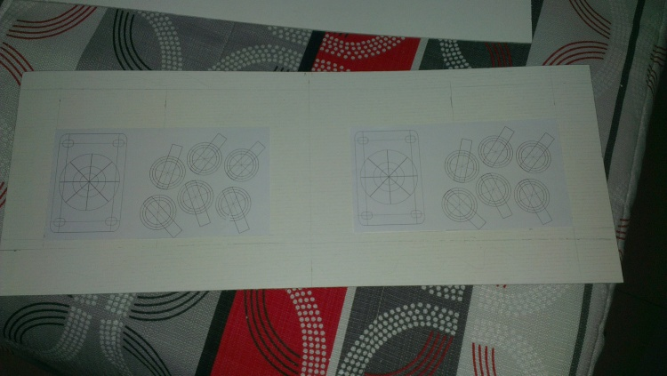
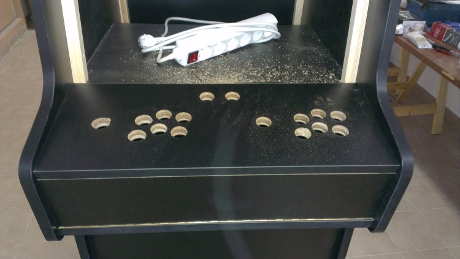
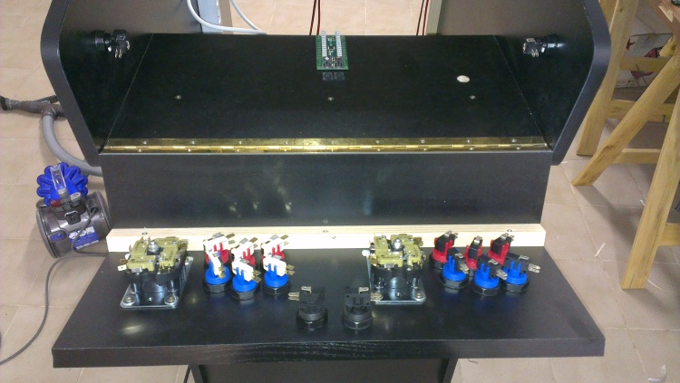
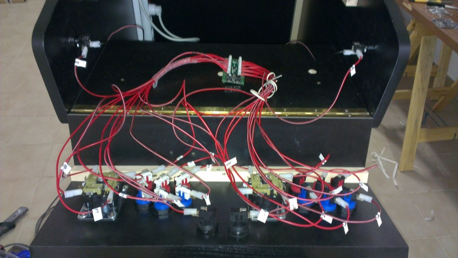
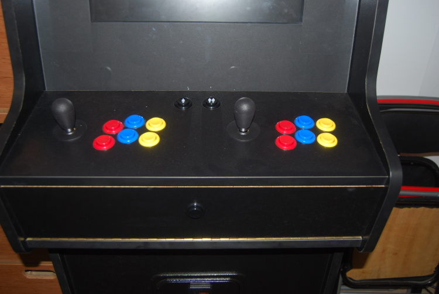
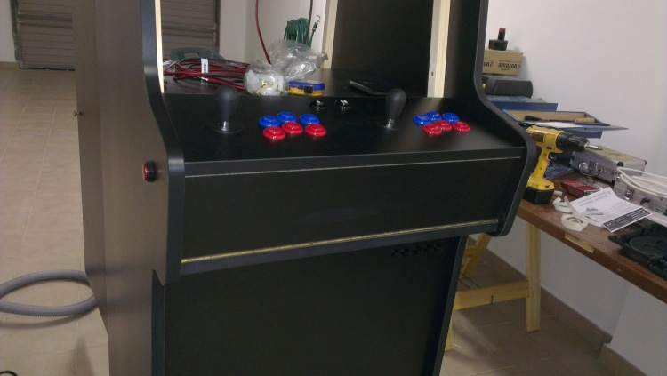
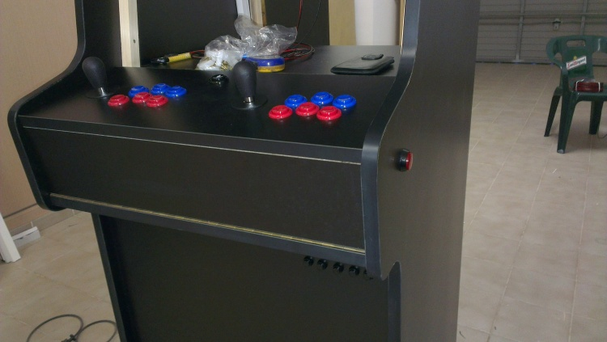

# Los Controles

Para el panel de control me he basado en el siguiente modelo:

> Plantilla usada para posicionamiento de botones y palanca

Este modelo lo he obtenido del  foro de ZonaArcade, del siguiente link:
[http://zonaarcade.forumcommunity.net/?t=13788157](http://zonaarcade.forumcommunity.net/?t=13788157)

Los pasos que he seguido para diseñar y construir el panel de controles han sido los siguientes:

Primero he creado una plantilla de cartón para realizar las pruebas de distribución de botones y palancas.

> Plantilla de cartón del planel de control

> Plantilla sobre panel de control

Después de esto he hecho los agujeros del panel de control sobre un trozo de aglomerado de igual tamaño que este, para ver como quedaba y comprobar que estaba todo correcto.

> Prueba panel de control

Después de comprobar que estaba todo correcto he hecho los agujeros sobre el panel real.

> Panel de control - Agujeros realizados

Después de realizar los agujeros he procedido montar los botones y las palancas.

> Botones y palancas montados

Después de montar los botones y palancas he montado el cableado de estos. Al mismo tiempo que estaba cableando los botones los etiqueté.

> Detalle del cableado del panel de control

El panel de control, una vez montado, ha quedado de esta forma:

> Panel de control acabado

Además de los botones de los controles le he añadido un botón frontal negro, puede apreciarse en la imagen anterior, para salir de los juegos, además de 2 botones para pinball (uno a cada lado de la máquina) y un monedero.

> Botonera y monedero

> Botón pinball izquierdo

> Botón pinball derecho

